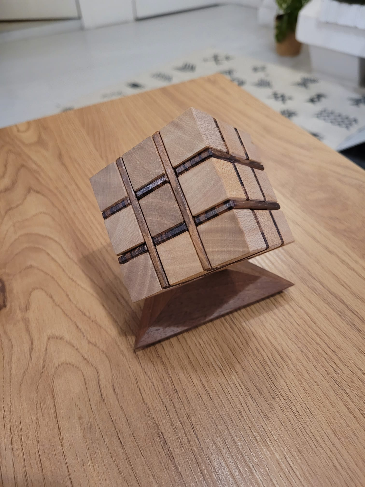

# Wooden Puzzle

A wooden puzzle I got as a gift. Turns out it's pretty difficult.

## Defining the problem space

The problem space is defined as a 3D grid of positions in the range [-2; +2]. Wooden cubes occupy positions -2, 0 or 2 in all directions. Only one dimention of the wooden plates can occupy the -1 or 1 position.

## Defining the pieces

Each of the 8 pieces is defined by the position of its elements, both cubes and plates. Plates are defined as 1, 2 or 3 elements depending on their length.
I attached pictures of each piece, their reference position and their id.

## Computing pieces permutations

For each piece we find all the position permutations by trying to apply all possible rotation matrices of angles 0, 90, 180 or 270 degrees in each of the 3 axes. We also apply all possible translations of -4, -2, 0, 2 or 4 in each direction. For each rotation/translation, we check if that position is valid by verifying all pieces fit in the problem space.

The piece 0 is special, it is the only one which cannot be translated in any direction. We do not need to rotate it either: it serves as the point of reference.

## Finding the solutions

There are 587 billions possible solutions if we were to try all possible possibles. Instead of checking the validity of each full solution, we can check the validity of a solution using only 2 pieces, then 3 pieces, and so on. If a partial solution does not work, we can skip all possible solutions starting with the invalid partial solution we just checked.

We repeat until finding a full solution. That reduces the number of checks required from 587 billions to 187 thousands.

## Building the puzzle

It turns out there is a single solution, which can be used to place each piece correctly. I am left with a final problem: finding the order in which to build the puzzle. Knowing the exact position of each piece makes this very easy, only a few minutes are needed.
